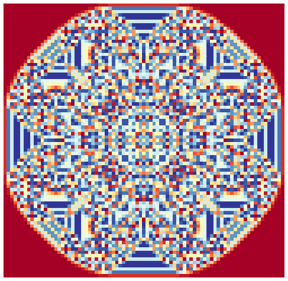

Sandpiles :: Fractal Generation And Visualisation
=================================================



Inspired by the [Numberphile video](https://www.youtube.com/watch?v=1MtEUErz7Gg)
on sandpile fractals, I wrote a small python (later go) program to generate the
fractal shown towards the end of the video. The next obvious step was to try new
toppling patterns and see what they produced!

I was able to get up to seed values of ~2^24 with my original algorithm but more
than that started to take days to complete runs. The original algorithm made a
crude estimate for the upper bound of the grid size based on the seed value and
then iterated over a 2D array to generate the fractals. Given that for a large
part of the computation, the majority of cells are not touched (if ever) this
wasn't very efficient.

The new algorithm uses a hash map for toppling which is then mapped to a 2D
array once we reach a steady state. This also allows for arbitrary co-ordinate
systems and grid layouts to be used which is what I'm exploring now.

#### Note
The original go code is also included for reference.


### Building the rust code
You will need a recent version of Rust installed (tested on 1.26.0 nightly) in
order to compile the code used for generating the datasets. Once you have Rust
installed run the following command to build the binary:
```bash
$ cargo build --release
```

### Running the binary directly
If you want to just generate output JSON files then run the following in the terminal
from the root of the repo:
```bash
$ ./target/release/sandpiles <POWER> <PATTERN>
```

- `POWER` is a power of 2 used for the starting sand pile.
- `PATTERN` is the toppling pattern to use, see `main.rs` or `sandpile.py` for a
  list of available patterns.

This will generate `2_<POWER>_<PATTERN>.json` in the `json/<PATTERN>` directory.


### Running from python
The Jupyter notebook gives example usage of the python wrapper code around the
executable:

```python
from sandpile import visualise

POWER   = 21
PATTERN = "o=+"
SIZE    = 8

visualise(sand_power=POWER, pattern=PATTERN, size=SIZE, cmap="RdYlBu", save=False, force=False)
```

See `sandpile.py` for API details.
